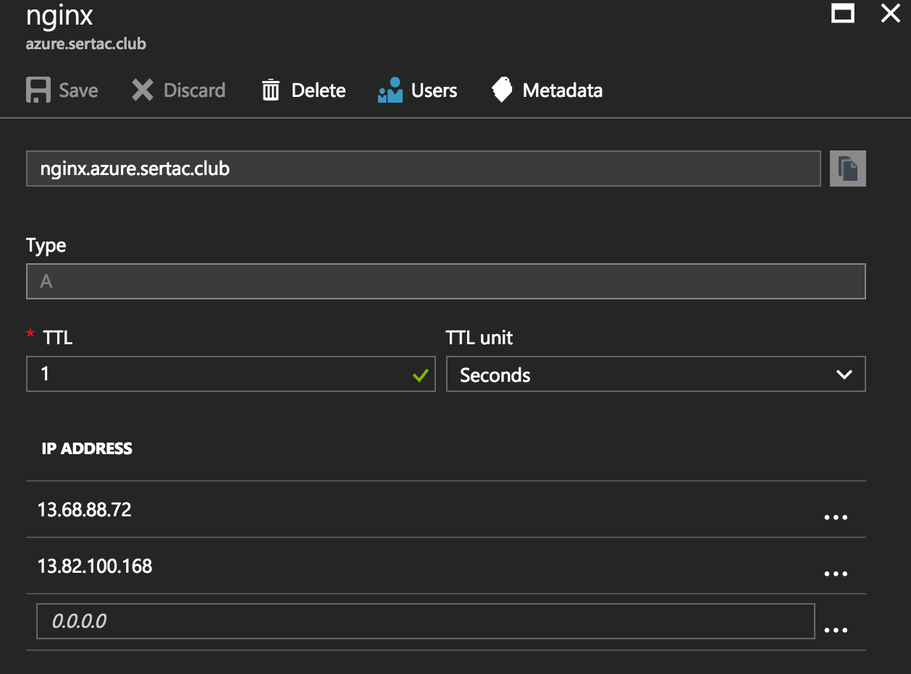
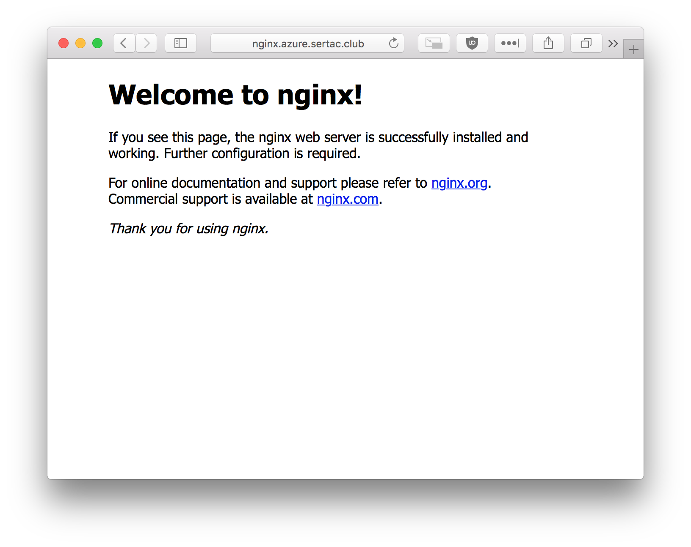

This guide is a walkthrough for creating Kubernetes cluster federation on Microsoft Azure using CoreDNS

## Prerequisites
Kubernetes 1.6+ with Beta APIs and RBAC enabled

## Deploying CoreDNS and etcd charts

`helm install --namespace etcd-operator --name etcd-operator stable/etcd-operator`

`helm upgrade --namespace etcd-operator --set cluster.enabled=true etcd-operator stable/etcd-operator`

Add a file called `values.yaml` with the following contents
```
isClusterService: false
serviceType: "LoadBalancer"
middleware:
  kubernetes:
    enabled: false
  etcd:
    enabled: true
    zones:
    - "azure.sertac.club."
    endpoint: "http://etcd-cluster.etcd-operator:2379"
```

`helm install --namespace etcd-operator --name coredns -f values.yaml stable/coredns`

## Provision federated control plane

Add a file called `coredns-provider.conf` with the following contents

```
[Global]
etcd-endpoints = http://etcd-cluster.etcd-operator:2379
zones = azure.sertac.club.
```

```
kubefed init federation \
    --host-cluster-context=eastus \
    --dns-provider=coredns \
    --dns-provider-config=coredns-provider.conf
```   

## Joining clusters to federation

`kubectl config use-context federation`

`kubefed join eastus --host-cluster-context=eastus`

`kubefed join westus --host-cluster-context=eastus`

## Create federated replicaset

`kubectl create -f https://github.com/kelseyhightower/kubernetes-cluster-federation/blob/master/rs/nginx.yaml`

## Create federated service

`kubectl create -f https://github.com/kelseyhightower/kubernetes-cluster-federation/blob/master/services/nginx.yaml`

## Add DNS records in your provider


## Navigate to your A record

